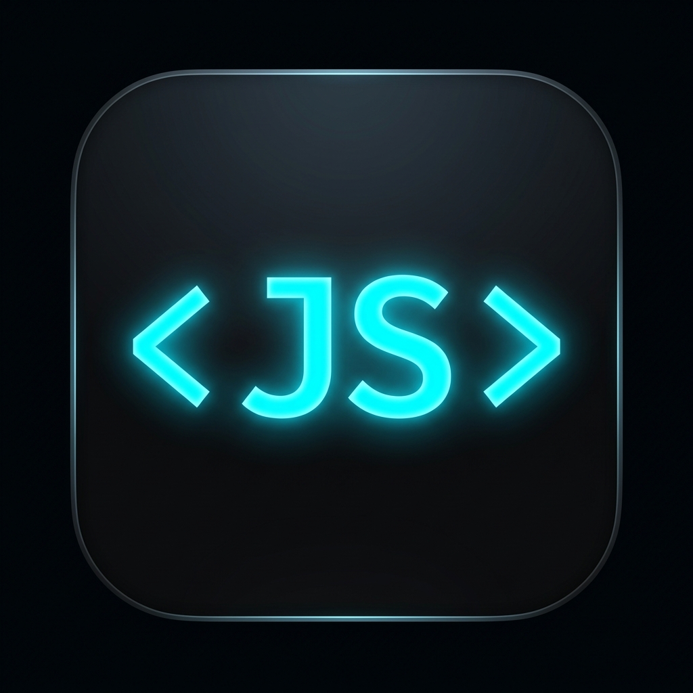

# JS Live Preview

<p align="center">
  
</p>

<p align="center">
  <strong>Instant side-by-side HTML, CSS & JavaScript Live Preview with interactive DevTools console right inside VS Code.</strong>
</p>

<p align="center">
  <a href="https://github.com/anushkumar701/VS-Extension/blob/main/LICENSE.txt"></a>
  
  
</p>

---

## 🌟 Key Features

- ⚡ **HTML & CSS Live Preview**: Instant side-by-side rendering for HTML and CSS files inside VS Code without needing external browser tabs.
- 📜 **JavaScript Execution**: Executes standalone `.js` scripts as well as embedded and linked scripts seamlessly.
- 🌐 **External Browser Support**: Open previews in standalone external browser windows with **Real-Time Hot Reloading (SSE)** and native F12 console forwarding.
- 🖥️ **DevTools Console Pane**: Intercepts `console.log()`, `console.info()`, `console.warn()`, `console.error()`, `console.table()`, and `console.dir()`.
- ⌨️ **Interactive REPL Console**: Evaluate JavaScript code directly in the console input with **Up/Down Arrow key command history navigation**.
- ⏱️ **Millisecond Timestamps**: Millisecond-accurate timestamping for every captured log entry.
- 📜 **Auto-Scrolling Log Output**: Console pane automatically auto-scrolls to the newest output entry.
- 📱 **Device Viewport Toggles**: Easily switch between **Desktop (100%)**, **Tablet (768px)**, and **Mobile (375px)** previews.
- ↔️ **Resizable Panels**: Smooth vertical resize handle to adjust height between preview and console.
- 🔒 **Tab-Locking**: Active editor tab lock prevents file explorer clicks from overwriting the live preview panel.

---

## 🚀 Getting Started

1. Install **JS Live Preview** from the VS Code Marketplace.
2. Open an HTML, CSS, or JavaScript file in VS Code.
3. Launch the preview using any of the following methods:
   - Click the **▶ Play Button** in the editor tab header.
   - Open Command Palette (`Ctrl+Shift+P` / `Cmd+Shift+P`) and select `Live Preview: Open`.
   - Press the shortcut **`Ctrl+Shift+Z`** or **`Ctrl+Shift+J`**.
4. Edit your code and watch the preview and console log outputs update in real time!

---

## 💡 Capabilities

### 1. Embedded Webview & External Browser Modes
Choose how you want to work! By default, **JS Live Preview** opens as a split-screen panel right inside VS Code. Prefer using Chrome, Firefox, or Edge? Click **🌐 Open in Browser** or set `jsLivePreview.openLocation` to `"externalBrowser"`.

### 2. DevTools Console & REPL History
The integrated console intercepts all standard logging methods (`log`, `warn`, `error`, `info`) with millisecond timestamps. The interactive REPL input allows you to evaluate expressions live, with **`Up Arrow` (↑)** and **`Down Arrow` (↓)** key support to cycle through past commands.

### 3. Responsive Device Viewports
Quickly test responsive designs by toggling viewport widths:
- 🖥️ **Desktop**: 100% full panel width
- 📟 **Tablet**: Fixed 768px width
- 📱 **Mobile**: Fixed 375px width

### 4. Smart Asset & Directory Resolution
Relative file paths (``, `<script src="../app.js">`, etc.) are resolved through a local ephemeral HTTP server with safety checks, ensuring zero `404 Not Found` resource errors.

---

## 🎮 Commands

| Command | Title | Description |
| :--- | :--- | :--- |
| `jsLivePreview.run` | `Live Preview: Open` | Opens the Live Preview & JavaScript Console side-by-side |
| `jsLivePreview.openExternal` | `Live Preview: Open in External Browser` | Opens the preview in a standalone external browser window |
| `jsLivePreview.clear` | `Live Preview: Clear Console` | Clears all log entries from the JavaScript console pane |

---

## ⌨️ Keyboard Shortcuts

| Shortcut | Command | Condition |
| :--- | :--- | :--- |
| `Ctrl+Shift+Z` / `Cmd+Shift+Z` | `jsLivePreview.run` | Active editor focus |
| `Ctrl+Shift+J` / `Cmd+Shift+J` | `jsLivePreview.run` | Active editor focus |

---

## ⚙️ Extension Settings

| Setting | Type | Default | Description |
| :--- | :--- | :--- | :--- |
| `jsLivePreview.openLocation` | `string` | `"sideBySide"` | Controls where preview opens: `"sideBySide"` (VS Code Webview) or `"externalBrowser"` (Default system web browser). |

---

## 📁 Example Starter Project

### `index.html`
```html
<!DOCTYPE html>
<html lang="en">
<head>
  <meta charset="UTF-8">
  <title>Live Preview Demo</title>
  <link rel="stylesheet" href="style.css">
</head>
<body>
  <h1>Hello, JS Live Preview!</h1>
  <button id="btn">Click Me</button>
  <script src="script.js"></script>
</body>
</html>
```

### `style.css`
```css
body {
  font-family: system-ui, sans-serif;
  padding: 24px;
  background: #0d1117;
  color: #58a6ff;
}
button {
  padding: 10px 20px;
  background: #238636;
  color: #ffffff;
  border: none;
  border-radius: 6px;
  cursor: pointer;
  font-weight: 600;
}
button:hover {
  background: #2ea043;
}
```

### `script.js`
```javascript
console.log("App initialized successfully!");

document.getElementById('btn').addEventListener('click', () => {
  console.info("Button clicked at " + new Date().toLocaleTimeString());
  fetch('https://jsonplaceholder.typicode.com/todos/1')
    .then(res => res.json())
    .then(data => console.log("Fetched data:", data))
    .catch(err => console.error("Fetch failed:", err));
});
```

---

## 🛡️ Security & Privacy

- **Sandboxed Execution**: Code executes inside a sandboxed frame protected by a strict Content Security Policy (`default-src 'none'`).
- **Path Traversal Protection**: Local HTTP server restricts file access strictly to project workspace boundaries.
- **Zero Telemetry**: JS Live Preview does not collect, log, or transmit telemetry data or personal information.

---

## 📄 License & Source

- **Repository**: [https://github.com/anushkumar701/VS-Extension](https://github.com/anushkumar701/VS-Extension)
- **License**: [MIT License](LICENSE.txt)
